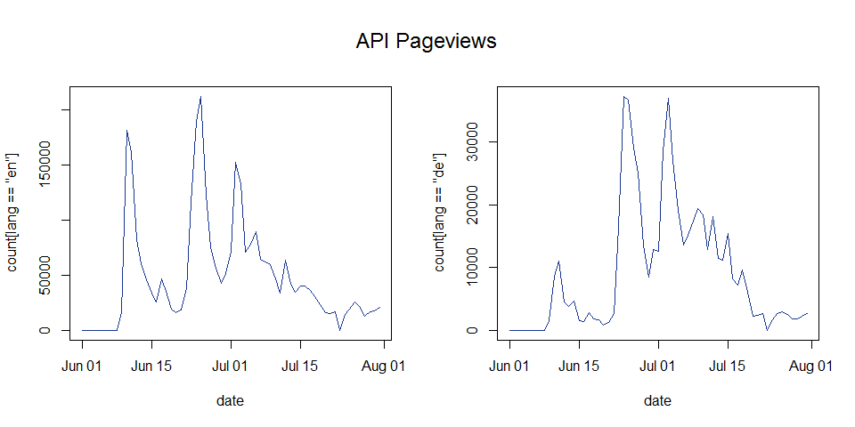

<!-- README.md is generated from README.Rmd. Please edit that file -->
R API Binding to Stats.grok.se Server
=====================================

**Status**

<a href="https://travis-ci.org/petermeissner/statsgrokse">  <a/> <a href="https://cran.r-project.org/package=statsgrokse">  </a> [](https://github.com/petermeissner/statsgrokse) [](https://codecov.io/gh/petermeissner/statsgrokse/tree/master/R)  

*lines of R code:* 313, *lines of test code:* 184

**Last change on code base**

2017-03-20 08:24:27

**Description**

The '<http://stats.grok.se>' server provides data and an API for Wikipedia page view statistics from 2008 up to 2015. This package provides R bindings to the API.

**License**

GPL (&gt;= 2) <br>Peter Meissner \[aut, cre\], R Core Team \[ctb\]

**Citation**

``` r
citation("statsgrokse")
```

**BibTex for citing**

``` r
toBibtex(citation("statsgrokse"))
```

**Installation**

Stable version from CRAN:

``` r
install.packages("statsgrokse")
```

Latest development version from Github:

``` r
devtools::install_github("petermeissner/statsgrokse")
```

Usage
=====

getting data
------------

The workhorse of the package is the `wp_trend()` function:

``` r
library(statsgrokse)

pageviews <-   
  statsgrokse(
    page = 
      c(
        "Application_programming_interface", 
        "Programmierschnittstelle"
      ), 
    from = "2014-12-01", 
    to   = "2015-01-06", 
    lang = c("en","de")
  )
## http://stats.grok.se/json/en/201412/Application_programming_interface
## http://stats.grok.se/json/en/201501/Application_programming_interface
## http://stats.grok.se/json/de/201412/Programmierschnittstelle
## http://stats.grok.se/json/de/201501/Programmierschnittstelle
```

plotting data
-------------

``` r
pageviews <- pageviews[order(pageviews$lang, pageviews$date), ]
par(mfrow=c(1,2), oma = c(0, 0, 1, 0))
with(
  pageviews,
  {
    plot(date[lang=="en"], count[lang=="en"], type="l", xlab = "date")
    plot(date[lang=="de"], count[lang=="de"], type="l", xlab = "date")
  }
)
mtext("API Pageviews", line=-2, outer = TRUE, cex = 1.5)
```



``` r
par(mfrow=c(1,1), oma=c(0,0,0,0))
```
